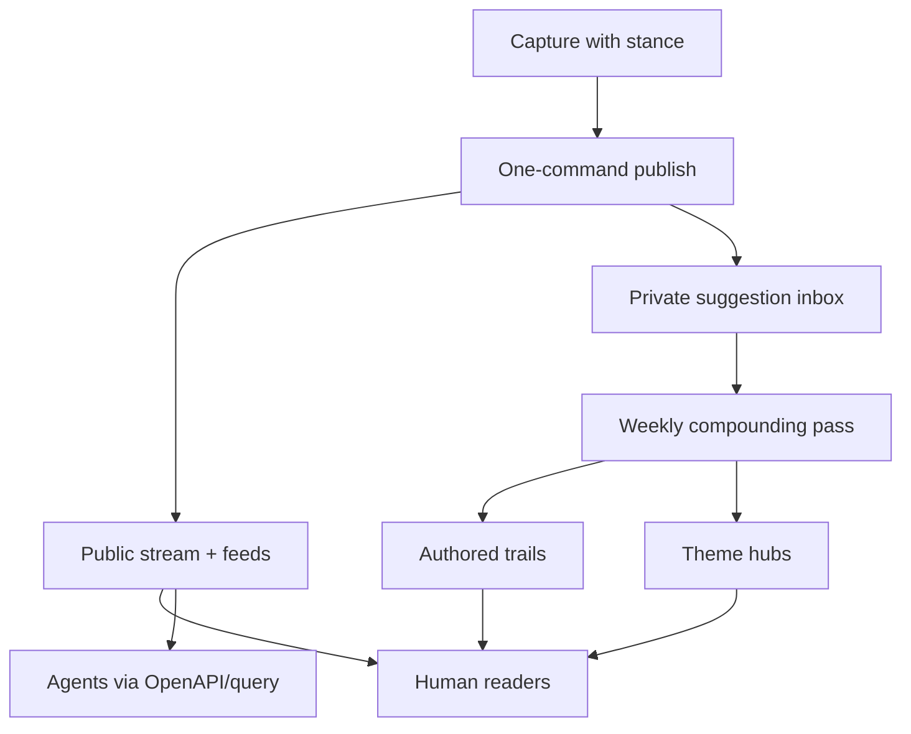

# Personal Musings Site - Plan

## Goal Capsule

- **Objective:** Ship a dual-audience personal site that uses a Matt Wood–shaped publishing chassis, run as an Attention Journal, so Anantha can keep a durable publishing habit of annotated thoughts and musings.
- **Product authority:** This plan owns the v1 personal musings site end-to-end (human stream, trails/themes via weekly compounding, agent-readable surfaces). Surrounding ideas from ideation that were rejected (graph-first publish, agents-only product, essay automation) are not active scope.
- **Open blockers:** None that block planning. Agent-surface edge cases (MCP) are deferred to planning as non-blocking.
- **Authority hierarchy:** Product Contract (R/KD, session-settled) outranks the Planning Contract. KTDs may only decide *how* to satisfy governed Rs, never *whether*.
- **Stop conditions:** Halt and flag (do not silently reinterpret) if: (a) an approach requires trail/theme authoring at publish time (violates R6/KD7); (b) agent surfaces require an always-on server or MCP without a documented unavoidable-parity finding (violates KD9/R15); (c) a stack choice forces recurring manual cleanup beyond the weekly pass (violates R9).
- **Execution profile:** Solo author, greenfield repo, static-first delivery, CI-driven builds. Optimize for still-easy publishing at item ~100.

---

## Product Contract

### Summary

Build a personal dual-audience site on a Matt Wood–shaped chassis — annotated link-forward stream, typed items, theme hubs, permalink trails, and OpenAPI-class agent surfaces — operated as an Attention Journal: every public item carries stance, publish stays one save/command, and a weekly pass authors trails and theme hubs.

### Problem Frame

Anantha wants a durable place for thoughts and musings inspired by mattwood.fyi, without inheriting digital-garden upkeep or a naked-bookmark dump. A prior personal site was abandoned; the load-bearing risk is ceremony that kills cadence. Greenfield repo (`graph-research`) has ideation only — no product yet.

### Key Decisions

- KD1. **Mattwood chassis + Attention Journal OS** over faithful twin or progressive-compounder UI — same public content/agent shape as the reference, with habit-protecting operating rules. (session-settled: user-approved — chosen over A faithful twin / C progressive compounder: habit is the success bar) Governs R1–R4, R8–R11.
- KD2. **Full thesis as v1** (Attention Journal, mattwood content model, local trails, earned themes, agent surfaces, maintenance ceiling) over a minimal stream-only cut. (session-settled: user-directed — chosen over minimal Attention Journal first: ship the whole product shape) Governs R1–R16.
- KD3. **Dual audience from day one** (humans + agents) over future-self-only or humans-only. (session-settled: user-directed — chosen over future-you / humans-only: agents are first-class readers) Governs R13–R15.
- KD4. **Mattwood-parity agent tooling in v1** over courtesy-only feeds/`llms.txt`. (session-settled: user-directed — chosen over courtesy-only / courtesy+one-query: dual-audience means tools) Governs R13–R15.
- KD5. **Link-forward mattwood design** over ideation’s riff-first default — annotated links lead; riff/essay remain available types. (session-settled: user-directed — chosen over riff-first / equal-weight mix: follow Matt Wood’s design) Governs R3–R5.
- KD6. **Trails remain in v1** but are authored only in the weekly batch, not at publish time. (session-settled: user-directed — chosen over deferring trails: keep the feature without taxing every publish) Governs R8–R11.
- KD7. **One save/command publish ceiling** with trails/themes confined to a weekly compounding pass. (session-settled: user-approved — chosen over publish-may-include-one-trail / full graph while publishing: protect habit) Governs R6, R8–R11.
- KD8. **Success = sustained publishing habit** over “agents used the corpus” or polished long-form as the primary win. (session-settled: user-directed — chosen over agent usage / public essay polish: habit is the outcome) Governs R16.
- KD9. **Agent floor for v1:** JSON Feed with typed metadata, `llms.txt`, stable permalinks, OpenAPI documenting corpus access, and a public query/search path agents can use. MCP tool servers stay out of v1 unless planning finds them required for parity with an unavoidable reference surface. Governs R13–R15.

### Actors

- A1. **Anantha (author)** — captures, publishes, and runs the weekly compounding pass.
- A2. **Human readers** — browse the chronological stream, theme hubs, and permalink trails.
- A3. **Agents / machines** — consume feeds, `llms.txt`, OpenAPI, and query surfaces without a human UI.

### Requirements

**Identity and reading**

- R1. The site’s primary public surface is a chronological Attention Journal: what Anantha has been noticing, questioning, and revising — not a portfolio or essay index.
- R2. The homepage answers “what has Anantha been paying attention to?” for human readers without requiring graph literacy.
- R3. Public content follows a Matt Wood–shaped type system of `link | riff | essay`, with the default public unit an annotated link (stance required).
- R4. Naked bookmarks without commentary are never public; they may exist only as private drafts or a private collecting desk.
- R5. Riffs and essays are supported types but do not displace the link-forward default on the primary stream.

**Publishing and maintenance**

- R6. Publishing a typical public item is a single save/command: capture content + required stance; no trail or theme authoring is required to publish.
- R7. Stable permalinks exist per public item (mattwood-style `/i/{id}` or equivalent durable path).
- R8. A bounded weekly compounding pass is a first-class author ritual: review suggested themes/edges and approve what becomes public structure.
- R9. Features that create recurring manual cleanup outside the weekly pass are rejected for v1.

**Trails and themes**

- R10. Each public permalink can show local authored trails with typed relations (at least `supports`, `challenges`, `develops_into` / became, `related_to`, `superseded_by`), each with a one-sentence reason and date when present.
- R11. Theme hubs are not a pre-built taxonomy; they are proposed when a topic recurs enough times and, once approved in the weekly pass, include a short authored “what I currently think,” key items, recent activity, and confirmed tensions — not a bare tag filter.
- R12. AI may suggest trail or theme candidates into a private inbox only; it never silently writes the public graph or theme synthesis.

**Agent surfaces**

- R13. The same public corpus powers human pages and machine surfaces: JSON Feed (typed item metadata), `llms.txt` explaining corpus use, semantic HTML, and stable permalinks.
- R14. v1 exposes OpenAPI documenting agent access to the corpus and a public query/search path so agents can ask corpus questions without scraping HTML.
- R15. MCP tool servers are out of v1 unless planning proves an unavoidable mattwood-parity gap that OpenAPI + query cannot cover.

**Success**

- R16. Success is measured primarily by whether Anantha is still publishing with comparable effort after the corpus has grown (habit sustained through item ~100), not by agent traffic or essay volume.

### Key Flows

- F1. One-command public publish
  - **Trigger:** Anantha has a link or musing ready to make public.
  - **Actors:** A1
  - **Steps:** Write item + required stance → single save/command → item appears on the chronological stream and in machine feeds with a stable permalink.
  - **Outcome:** Public record updated without trail/theme work.
  - **Covered by:** R3, R4, R6, R7, R13

- F2. Weekly compounding pass
  - **Trigger:** End of a capture week (or author-chosen review time).
  - **Actors:** A1
  - **Steps:** Open private suggestion inbox → approve/reject trail candidates and theme proposals → author one-sentence trail reasons and any theme “what I currently think” → publish structure only for approved items.
  - **Outcome:** Trails/themes grow without changing day-to-day publish friction.
  - **Covered by:** R8–R12

- F3. Human reader follows a trail
  - **Trigger:** Reader opens a permalink that has authored connections.
  - **Actors:** A2
  - **Steps:** Read item → see local typed trails with reasons → follow a related permalink.
  - **Outcome:** Reader understands how ideas push on each other without a global graph UI.
  - **Covered by:** R2, R10

- F4. Agent consumes the corpus
  - **Trigger:** An agent needs Anantha’s public thinking on a topic.
  - **Actors:** A3
  - **Steps:** Discover via `llms.txt` / OpenAPI → fetch feed or query → use stable permalinks for citation.
  - **Outcome:** Machine access without treating the human UI as a scrape target.
  - **Covered by:** R13–R14



### Acceptance Examples

- AE1. Stance gate
  - **Covers:** R3, R4, R6
  - **Given:** A link with no commentary
  - **When:** Anantha attempts to publish it publicly
  - **Then:** Publish is blocked or routes to private draft; the public stream is unchanged

- AE2. Publish without graph work
  - **Covers:** R6, R8, R10
  - **Given:** Anantha has stance text ready and no trail picks
  - **When:** They run the single publish action
  - **Then:** The item is live on the stream and feeds; no trail authoring was required

- AE3. Weekly trail appears on permalink
  - **Covers:** R8, R10, R12
  - **Given:** Two public items and an AI-suggested `challenges` edge in the private inbox
  - **When:** Anantha approves it in the weekly pass with a one-sentence reason
  - **Then:** Both permalinks show the typed trail with reason and date; the edge was not public before approval

- AE4. Theme earns existence
  - **Covers:** R11, R12
  - **Given:** A topic has recurred enough times to propose a hub
  - **When:** Anantha approves the hub and writes the short current-stance blurb
  - **Then:** A theme hub page exists with that blurb, key items, and recent activity — not merely a filtered tag list

- AE5. Agent query path
  - **Covers:** R13, R14
  - **Given:** Several public items on one theme
  - **When:** An agent follows OpenAPI/`llms.txt` and queries the corpus
  - **Then:** It receives typed results with stable permalinks without scraping the HTML stream

### Success Criteria

- S1. Anantha can publish a typical annotated link in one save/command after the site has dozens of items.
- S2. After ~3 months of intended use, publishing cadence is still alive (habit), even if some weeks skip the compounding pass.
- S3. A cold human reader can understand a permalink’s local trails without opening a graph explorer.
- S4. An agent can discover and query the public corpus via documented machine surfaces.

### Scope Boundaries

**Deferred for later**

- MCP tool servers (unless planning finds an unavoidable parity gap — see KD9 / R15)
- Essay-from-cluster automation and other auto-coherence writers
- Graph explorer / global graph viz as a reader destination
- Tension inbox as a primary standalone product surface

**Outside this product's identity**

- Portfolio / resume site
- Agents-only schema with human UI as a thin debug view
- Graph-required publishing (edge before publish)
- Premature taxonomy / theme corridors as the homepage IA
- Heavy maintenance cockpit or team-scale garden tooling

### Dependencies / Assumptions

- D1. Reference inspiration: [mattwood.fyi](https://mattwood.fyi) content model and dual-audience surfaces; this plan is inspired-by, not a pixel clone.
- D2. Ideation source: `docs/ideation/2026-09-04-personal-musings-site-ideation.md` (and HTML twin).
- A1. Prior site abandonment was driven mainly by upkeep/ceremony; the maintenance ceiling and weekly batch address that failure mode (evidence is thin — correct if wrong).
- A2. Theme-proposal heuristic defaults to 3 independent items sharing a tag/topic (Planning Contract AS2); author still approves in the weekly pass.
- A3. Repo is greenfield aside from ideation; no existing app stack constrains product behavior.

### Outstanding Questions

**Resolve Before Planning**

- None.

**Deferred to Planning**

- Q1. Weekly inbox UX polish beyond `scripts/weekly.ts` scaffold + `docs/weekly-pass.md` runbook (threshold default locked in Planning Contract AS2: 3 tagged items).
- Q2. Visual design system / branding beyond the IA implied by the mattwood chassis (typography, color, motion) — not needed to start U1–U8.
- Q3. Exact static host provider among GitHub Pages / Netlify / Cloudflare Pages (KTD8 / AS3 — pick at U8 based on least credential friction).

### Sources / Research

- `docs/ideation/2026-09-04-personal-musings-site-ideation.md` — ranked product thesis and rejections
- [mattwood.fyi](https://mattwood.fyi) — reference dual-audience tumblelog (typed items, trails, themes, agent surfaces)

---

## Planning Contract

### Key Technical Decisions

- KTD1. Astro SSG with Markdown content collections as the site generator, over Next.js/Eleventy/Hugo. Rationale: Astro's typed content collections give schema validation (stance-required gate, item type) at build time with zero client JS by default, and ships first-class support for build-time data endpoints (JSON, feeds) needed for R13–R14. Satisfies the Maintenance Ceiling (ideation) and R9 by keeping publish = file + git commit. Does not duplicate a product KD — this is a HOW choice implementing KD1/KD7/R6/R9's "low ceremony, static preference."
- KTD2. Git + Markdown files as the content store and CI/CD as the publish trigger (GitHub Actions build + deploy on push to main), over a CMS or database-backed app. Rationale: directly implements the "content-as-files projected to a static site" preference from ideation's Maintenance Ceiling, and keeps R6's one-command publish literally one `git commit && git push` (or one CLI wrapper script). Inherits KD7/R6/R9; not a new product decision.
- KTD3. Build-time generation for all machine surfaces (JSON Feed, `llms.txt`, OpenAPI spec, search index) — no runtime API server. Rationale: directly implements KD9's agent floor (JSON Feed, `llms.txt`, permalinks, OpenAPI, query/search path) while honoring "MCP/live server out of v1" (R15) and the zero-always-on-server preference. All "endpoints" are static JSON files served by the static host; the "query/search path" (R14) is satisfied by a static, pre-built search index queried client-side or via a documented static JSON contract — not a live query backend.
- KTD4. Pagefind for the static search index, documented as a described capability in the OpenAPI spec (search index shape + how to fetch/use it), over building a bespoke search-index.json or a hosted search service. Rationale: Pagefind indexes static HTML at build time, ships a small client runtime, requires no server, and its index files can be fetched directly by agents (satisfies "public query/search path" in R14 without a live backend). If Pagefind's on-disk index format proves awkward for agent consumption, fall back to also emitting a documented flat `search-index.json` (title, type, stance, permalink, tags) alongside it — cheap, no removal of Pagefind needed.
- KTD5. Content schema fields: every item has `id` (slug, used in `/i/{id}`), `type: link | riff | essay`, `title`, `date`, `stance` (required, non-empty string), `url` (required only when `type: link`), `tags: string[]`, `status: public | draft`, optional `context` (free text). A Zod schema (Astro content collections) enforces `stance` non-empty and `url` presence for `type: link` at build time. Rationale: this is the concrete schema implementing R3–R5's type system and R4's stance gate; the build fails (or the item is excluded from public output) if the gate is violated, which is the mechanical enforcement of "naked bookmarks are never public."
- KTD6. Trails and themes stored as separate, weekly-pass-only content: trails as a `trails` collection (edge records: `from`, `to`, `type`, `reason`, `date`) and themes as a `themes` collection (hub frontmatter + authored body), both edited only during the weekly pass, never required by the publish flow for `items`. Rationale: mechanically enforces KD7/R6 (publish never touches trails/themes files) and KD6 (trails authored only in weekly batch) by physical separation of content directories/collections, not just convention.
- KTD7. AI suggestion inbox as a local, non-public, git-ignored (or private-branch) file (`inbox/suggestions.yml` or similar), populated by an offline/manual script run during the weekly pass, never committed to the public build output. Rationale: implements R12 (AI suggests into a private inbox only, never writes the public graph) with the simplest mechanism available in a static, no-backend stack — no server-side auth/private-DB needed.
- KTD8. Deploy target: static host with CI build (e.g. GitHub Pages, Netlify, or Cloudflare Pages — exact provider is an environment/deploy-secrets decision made at CI setup time, not a product decision). Rationale: any of these satisfy KTD1–KTD3's zero-always-on-server constraint; provider choice is deferred to Unit U8 as an infra detail, flagged as an open KTD-sub-decision rather than blocking planning.

### Technical Design (high-level)

```
content/
  items/*.md        -- link | riff | essay, frontmatter-validated (KTD5)
  trails/*.yml       -- weekly-pass-authored edges (KTD6)
  themes/*.md        -- weekly-pass-authored hub pages (KTD6)
inbox/
  suggestions.yml     -- private AI-suggested candidates, never built into output (KTD7)
src/
  pages/               -- Astro routes: /, /i/[id], /themes/[slug], /feed.json, /llms.txt, /openapi.json
  content/config.ts    -- Zod schemas + stance/url gate (KTD5)
scripts/
  publish.sh           -- one-command wrapper: validate + git add/commit/push (R6)
  weekly.ts            -- weekly pass helper: reads inbox, scaffolds trail/theme files for review (R8)
public/                -- Pagefind output, static assets
.github/workflows/
  ci.yml               -- lint/test/build on PR
  deploy.yml           -- build + deploy static output on push to main
```

Human stream = Astro pages rendering the `items` collection chronologically (R1–R2). Permalinks = `/i/{id}` static routes (R7). Trails render on each item's permalink page by looking up `trails` entries referencing that `id` (R10). Theme hubs = static pages built from the `themes` collection, listing member items by tag/reference plus authored blurb (R11). Machine surfaces (`feed.json`, `llms.txt`, `openapi.json`, Pagefind index) are generated from the same `items`/`themes` collections at build time (R13–R14), guaranteeing human and agent views can never drift.

### Assumptions / Constraints

- AS1. Astro + Markdown + static hosting is available and sufficient for a personal-scale corpus (dozens to low-hundreds of items per S1/S2); no dynamic backend is required to hit success criteria. If this assumption breaks (e.g. a genuine need for live query beyond static search), it is a scope change requiring a new KD, not a KTD patch.
- AS2. "Enough recurrence" for a theme proposal (deferred as Q1/A2 in the Product Contract) defaults to **3 independent items sharing a tag/topic** for the weekly-pass suggestion script to flag it as a candidate; this is a suggestion heuristic only — the author approves/rejects in the weekly pass, so a wrong threshold has no public-facing cost.
- AS3. Deploy provider (GitHub Pages vs Netlify vs Cloudflare Pages) is picked at CI setup time (Unit U8) based on whichever requires the least secret/credential setup in this environment; does not affect any R.
- AS4. No authentication/multi-user concerns — single author, public read-only site plus a private (git-ignored) inbox file.
- AS5. Mobile/on-the-go capture (ideation downside of files/git workflows) is out of scope for v1; publish is via a local git workflow (R6 is satisfied by "single command," not "single tap from any device").

### Sequencing

U1 (scaffold) → U2 (content schema + stance gate) → U3 (stream + permalinks) → U4 (trails) and U5 (themes) [can proceed in parallel after U3] → U6 (machine surfaces, depends on U2–U5 schemas existing) → U7 (weekly compounding conventions/tooling, depends on U4–U6) → U8 (CI/tests/deploy, can start scaffolding after U1 but final gate depends on U2–U6 being testable).

---

## Implementation Units

### U1. Project scaffold

- **Goal:** Stand up an Astro project with the directory layout in Technical Design, ready for content collections.
- **Requirements:** R6, R9 (low-ceremony foundation); supports all downstream Rs.
- **Files:** `astro.config.mjs`, `package.json`, `tsconfig.json`, `src/content/config.ts` (stub), `src/pages/index.astro` (stub), `.gitignore` (must ignore `inbox/`), `README.md` (update with dev/publish instructions).
- **Approach:** `npm create astro@latest` with minimal template, add `@astrojs/mdx` if needed, set up TypeScript strict mode, establish `content/`, `inbox/`, `scripts/` directories per Technical Design.
- **Test Scenarios:** (1) `npm run build` produces `dist/` with no errors on an empty content set. (2) `npm run dev` serves a blank homepage locally.
- **Verification:** `npm run build` exit code 0; `dist/index.html` exists.
- **Dependencies:** None.

### U2. Content schema + stance gate

- **Goal:** Implement the `items` content collection schema enforcing type system and stance requirement (R3, R4, R5).
- **Requirements:** R3, R4, R5.
- **Files:** `src/content/config.ts`, `content/items/*.md` (seed with 2–3 example items: one `link`, one `riff`), `src/lib/gate.ts` (build-time validation helper).
- **Approach:** Define Zod schema: `type: z.enum(['link','riff','essay'])`, `stance: z.string().min(1)`, `url: z.string().url().optional()` refined to required when `type === 'link'`, `status: z.enum(['public','draft']).default('public')`. Astro's `getCollection('items')` filters `status: 'public'` for all public-facing pages/feeds; `draft` items are never emitted to any public output (satisfies R4's "naked bookmarks... may exist only as private drafts").
- **Test Scenarios:** (1) A `link` item with empty `stance` fails the build (schema validation error). (2) A `link` item with no `url` fails the build. (3) A `riff` item with `stance` and no `url` builds successfully. (4) An item with `status: draft` builds but does not appear in `getCollection('items', ({data}) => data.status === 'public')` results.
- **Verification:** `npm run build` fails (non-zero exit) on a deliberately invalid seed item; passes on valid seeds. Add a unit test (Vitest) asserting the Zod schema rejects/accepts the above cases.
- **Dependencies:** U1.

### U3. Stream + permalinks

- **Goal:** Render the chronological Attention Journal homepage and per-item permalink pages (R1, R2, R7).
- **Requirements:** R1, R2, R7; Flow F1 (publish → appears on stream), F3 (reader follows permalink).
- **Files:** `src/pages/index.astro`, `src/pages/i/[id].astro`, `src/lib/items.ts` (shared query/sort helper).
- **Approach:** Homepage lists public items newest-first with type badge, date, and stance excerpt — no essay/portfolio framing (R1/R2). Each item's `id` (frontmatter slug) drives a static route at `/i/{id}` (R7) rendering full content, stance, and (once U4 lands) local trails. Sorting/filtering logic centralized in `src/lib/items.ts` for reuse by feeds/search.
- **Test Scenarios:** (1) With 3 public + 1 draft item, homepage renders exactly 3, newest first. (2) `/i/{id}` for each public item returns 200 with correct title/stance. (3) A draft item's permalink route is not generated (404 or excluded from `getStaticPaths`).
- **Verification:** `npm run build` then check `dist/i/<id>/index.html` exists only for public items; add a Playwright or simple DOM assertion test checking homepage item count/order.
- **Dependencies:** U2.

### U4. Trails

- **Goal:** Author and render local typed trails on permalink pages, editable only via the weekly pass (R8, R10, R12; Flow F2, F3).
- **Requirements:** R8, R10, R12.
- **Files:** `content/trails/*.yml` (or single `content/trails/index.yml`), `src/content/config.ts` (add `trails` collection schema), `src/components/TrailList.astro`, update `src/pages/i/[id].astro` to include trails.
- **Approach:** Trail schema: `{from: string, to: string, type: 'supports'|'challenges'|'develops_into'|'related_to'|'superseded_by', reason: z.string().min(1), date: z.string()}`. On each item permalink, query trails where `from === id || to === id`, render type + reason + date + link to the other item. Trails collection lives outside `items/`, so nothing in the publish path (U3/scripts/publish.sh) touches it — mechanically enforces "not required to publish" (R6/R8).
- **Test Scenarios:** (1) A trail with empty `reason` fails schema validation at build. (2) Given two items and one `challenges` trail between them, both permalinks render the trail with reason and date (mirrors AE3). (3) An item with no trails renders its permalink without a trails section (no empty-state clutter, or a clearly empty "no trails yet" state — author's choice, not a hard requirement).
- **Verification:** Build-time schema test (Vitest) for reason requirement; rendered-HTML assertion (Playwright or string match on `dist/i/{id}/index.html`) that both endpoints of a trail show the connection.
- **Dependencies:** U2, U3.

### U5. Themes

- **Goal:** Render theme hub pages with authored "what I currently think," key items, recent activity, confirmed tensions — populated only via the weekly pass (R11, R12; Flow F2).
- **Requirements:** R11, R12.
- **Files:** `content/themes/*.md`, `src/content/config.ts` (add `themes` collection schema), `src/pages/themes/[slug].astro`, `src/pages/themes/index.astro` (optional theme index for discoverability, still R2-consistent — not a bare tag filter).
- **Approach:** Theme schema: `{title, slug, currentThinking: z.string().min(1), items: z.array(z.string()), tensions: z.array(z.string()).optional()}`. Body markdown holds the longer authored synthesis. `items` array references item `id`s (must resolve at build time — fail build if a referenced id doesn't exist, catching stale references). Theme pages are hand-authored files, never auto-generated into public output by any publish-time script (enforces R12/KD6).
- **Test Scenarios:** (1) A theme referencing a nonexistent item id fails the build with a clear error. (2) A theme page renders `currentThinking`, linked key items, and tensions (mirrors AE4). (3) The themes index lists theme titles/slugs without inventing a tag-filter view — matches R11's "not a bare tag filter" by never generating a hub automatically from tags alone.
- **Verification:** Build-time reference-integrity check (custom Astro integration or a Node script in `scripts/verify-content.ts` run in CI) that scans `themes` collections for dangling item references; Vitest test for the check itself.
- **Dependencies:** U2, U3.

### U6. Machine surfaces (JSON Feed, `llms.txt`, OpenAPI, search index)

- **Goal:** Expose the agent floor from KD9/R13–R14 as static, build-time-generated artifacts (Flow F4, AE5).
- **Requirements:** R13, R14, R15 (stay within: no MCP, no live server).
- **Files:** `src/pages/feed.json.ts`, `public/llms.txt` (or `src/pages/llms.txt.ts` for dynamic generation), `public/openapi.json` (or generated via `src/pages/openapi.json.ts`), Pagefind config in `astro.config.mjs`, `docs/agent-surfaces.md` (short doc describing each surface, linked from `llms.txt`).
- **Approach:** `feed.json.ts` emits JSON Feed 1.1 with custom `_musings` extension fields (`type`, `stance`, `tags`) per item, generated from `getCollection('items')` — same data source as U3, guaranteeing no drift. `llms.txt` explains the corpus, links to `feed.json`, `openapi.json`, and the Pagefind index location, and states MCP is intentionally out of v1 (documents R15's boundary for agent readers). `openapi.json` documents: `GET /feed.json` (item list), `GET /i/{id}` (HTML permalink), `GET /themes/{slug}`, and the search path — described as "static Pagefind index at `/pagefind/`, query client-side or fetch index fragments directly" per KTD4, satisfying R14's "public query/search path" without a live backend. Pagefind runs as a post-build step (`astro build && pagefind --site dist`) indexing all public HTML.
- **Test Scenarios:** (1) `feed.json` validates against JSON Feed 1.1 schema and contains one entry per public item with `type`/`stance` fields. (2) `llms.txt` is reachable at the site root and mentions `feed.json`/`openapi.json`/search. (3) `openapi.json` is valid OpenAPI 3.x (lint with a validator) and every documented path corresponds to a real static route or documented index location. (4) After `pagefind` runs, `dist/pagefind/pagefind.json` exists and a sample query against the Pagefind JS API returns the seeded items.
- **Verification:** `npx @redocly/cli lint public/openapi.json` (or similar OpenAPI linter) exit 0; a Node script fetching/parsing `feed.json` against the JSON Feed schema; CI step asserting `dist/pagefind/` is non-empty post-build.
- **Dependencies:** U2, U3, U5 (theme routes referenced in OpenAPI).

### U7. Weekly compounding conventions + tooling

- **Goal:** Give the author a bounded, low-ceremony ritual for reviewing AI-suggested trail/theme candidates and turning approved ones into committed content (R8, R9, R12; Flow F2).
- **Requirements:** R8, R9, R12.
- **Files:** `scripts/weekly.ts`, `inbox/suggestions.yml` (git-ignored, template only committed as `inbox/suggestions.example.yml`), `docs/weekly-pass.md` (author-facing runbook).
- **Approach:** `weekly.ts` is a local CLI: reads `inbox/suggestions.yml` (candidate trails/themes, produced by whatever offline process the author runs — out of scope to build the AI suggester itself for v1; the contract is just the YAML shape), prints a reviewable summary, and on approval scaffolds a new file under `content/trails/` or `content/themes/` for the author to fill in the required reason/currentThinking text before committing. The script never auto-writes public content without the human-authored required fields (enforces R12 mechanically: the scaffold has empty required fields that fail U2/U4/U5's build-time schema until the author fills them in).
- **Test Scenarios:** (1) Given a sample `suggestions.yml` with one trail candidate, running `weekly.ts` produces a scaffold trail file with `reason: ""` (i.e., still fails build until authored — proves it can't silently go public). (2) Running `weekly.ts` with an empty inbox exits cleanly with a "nothing to review" message (bounded, no forced work — supports R9). (3) `docs/weekly-pass.md` runbook steps, followed literally, take a reviewer from inbox to a building, valid trail/theme file.
- **Verification:** Vitest test for `weekly.ts`'s scaffold-generation logic; manual runbook walkthrough documented as a checklist in `docs/weekly-pass.md`.
- **Dependencies:** U4, U5.

### U8. CI, tests, and deploy

- **Goal:** Automate build validation on PRs and static deploy on merge, closing the loop on "one-command publish" (R6, R9) and giving the whole plan a repeatable verification path.
- **Requirements:** R6, R9 (indirectly — CI is what makes "single command" safe/trustworthy); supports S1–S4 by making the corpus verifiable at every size.
- **Files:** `.github/workflows/ci.yml`, `.github/workflows/deploy.yml`, `scripts/publish.sh`, `package.json` (test/lint/build scripts).
- **Approach:** `ci.yml` runs on PR: `npm ci`, `npm run lint`, `npm run test` (Vitest: schema tests from U2/U4/U5, weekly.ts tests from U7), `npm run build` (includes Pagefind + OpenAPI/feed generation + content reference-integrity check from U5), and an OpenAPI lint step. `deploy.yml` runs on push to `main`: same build, then deploy `dist/` to the chosen static host (KTD8/AS3 — provider picked here). `scripts/publish.sh` wraps `git add <file> && git commit -m "..." && git push` with a pre-commit build/lint check, giving R6's "single command" a literal CLI form.
- **Test Scenarios:** (1) A PR with an invalid item (empty stance) fails CI at the build step. (2) A PR with all valid content passes CI end-to-end. (3) Merging to `main` triggers a deploy run that succeeds and the live site serves the updated homepage. (4) `scripts/publish.sh` run locally against a valid new item performs commit+push in one invocation.
- **Verification:** Green CI run on a test PR (`gh run list`/`gh run view` after push); manual check that the deployed URL reflects the latest content after a `main` merge.
- **Dependencies:** U1–U7 (final gate; can scaffold workflow files earlier).

---

## Verification Contract

Once the stack is scaffolded (post-U1), the following commands gate every unit:

```bash
# Install
npm ci

# Lint
npm run lint

# Unit tests (schema gates, weekly.ts scaffold logic, content reference-integrity)
npm run test

# Build (includes: content schema validation, feed.json/llms.txt/openapi.json generation, Pagefind indexing)
npm run build

# OpenAPI validity
npx @redocly/cli lint public/openapi.json

# Content reference-integrity (dangling trail/theme item references)
node scripts/verify-content.ts

# Local smoke check
npm run preview   # serve dist/ and manually hit /, /i/{id}, /themes/{slug}, /feed.json, /llms.txt, /openapi.json, /pagefind/pagefind.json
```

CI (`.github/workflows/ci.yml`) runs lint + test + build + OpenAPI lint + content-integrity on every PR; `deploy.yml` re-runs build then deploys `dist/` on merge to `main`.

---

## Definition of Done

- All Implementation Units U1–U8 complete with their Test Scenarios passing locally and in CI.
- `npm run build` succeeds from a clean checkout with zero manual steps beyond `npm ci`.
- A seeded corpus of at least 3 public items (one `link`, one `riff`, one with a trail, one theme referencing ≥3 items) round-trips through: homepage stream (R1/R2) → permalink with trail (R7/R10) → theme hub (R11) → `feed.json`/`llms.txt`/`openapi.json`/Pagefind index (R13/R14) — all generated from the same content source with no drift.
- A deliberately invalid item (naked link, no stance) fails the build, demonstrating the stance gate (R4) is enforced mechanically, not by convention.
- `scripts/publish.sh` publishes a new valid item in one invocation with no required trail/theme step (R6).
- `scripts/weekly.ts` walks a sample inbox entry to a buildable (post-authoring) trail or theme file, demonstrating R8/R12's weekly-pass-only, human-approved structure.
- CI is green on a representative PR; a merge to `main` produces a working deploy.
- No MCP tool server, live query backend, or always-on process exists anywhere in the stack (R15/KD9 boundary respected).
- `docs/plans/...plan.md` frontmatter reads `artifact_readiness: implementation-ready` and this Planning Contract + Implementation Units are merged into that file without altering any existing R/KD/session-settled text.
