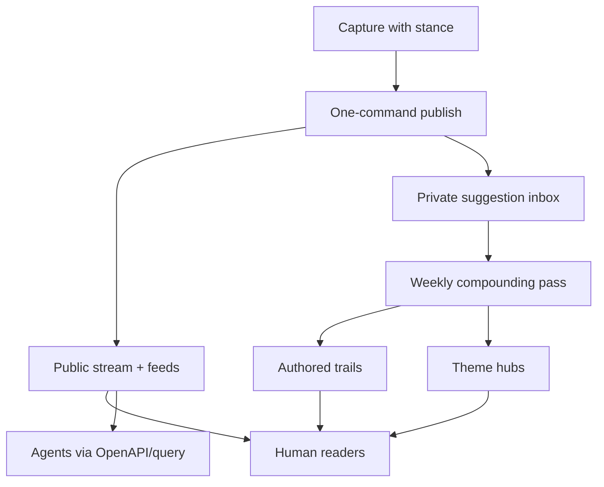

# Personal Musings Site - Plan

## Goal Capsule

- **Objective:** Ship a dual-audience personal site that uses a Matt Wood–shaped publishing chassis, run as an Attention Journal, so Anantha can keep a durable publishing habit of annotated thoughts and musings.
- **Product authority:** This plan owns the v1 personal musings site end-to-end (human stream, trails/themes via weekly compounding, agent-readable surfaces). Surrounding ideas from ideation that were rejected (graph-first publish, agents-only product, essay automation) are not active scope.
- **Open blockers:** None that block planning. Agent-surface edge cases (MCP) are deferred to planning as non-blocking.

---

## Product Contract

### Summary

Build a personal dual-audience site on a Matt Wood–shaped chassis — annotated link-forward stream, typed items, theme hubs, permalink trails, and OpenAPI-class agent surfaces — operated as an Attention Journal: every public item carries stance, publish stays one save/command, and a weekly pass authors trails and theme hubs.

### Problem Frame

Anantha wants a durable place for thoughts and musings inspired by mattwood.fyi, without inheriting digital-garden upkeep or a naked-bookmark dump. A prior personal site was abandoned; the load-bearing risk is ceremony that kills cadence. Greenfield repo (`graph-research`) has ideation only — no product yet.

### Key Decisions

- KD1. **Mattwood chassis + Attention Journal OS** over faithful twin or progressive-compounder UI — same public content/agent shape as the reference, with habit-protecting operating rules. (session-settled: user-approved — chosen over A faithful twin / C progressive compounder: habit is the success bar) Governs R1–R4, R8–R11.
- KD2. **Full thesis as v1** (Attention Journal, mattwood content model, local trails, earned themes, agent surfaces, maintenance ceiling) over a minimal stream-only cut. (session-settled: user-directed — chosen over minimal Attention Journal first: ship the whole product shape) Governs R1–R16.
- KD3. **Dual audience from day one** (humans + agents) over future-self-only or humans-only. (session-settled: user-directed — chosen over future-you / humans-only: agents are first-class readers) Governs R13–R15.
- KD4. **Mattwood-parity agent tooling in v1** over courtesy-only feeds/`llms.txt`. (session-settled: user-directed — chosen over courtesy-only / courtesy+one-query: dual-audience means tools) Governs R13–R15.
- KD5. **Link-forward mattwood design** over ideation’s riff-first default — annotated links lead; riff/essay remain available types. (session-settled: user-directed — chosen over riff-first / equal-weight mix: follow Matt Wood’s design) Governs R3–R5.
- KD6. **Trails remain in v1** but are authored only in the weekly batch, not at publish time. (session-settled: user-directed — chosen over deferring trails: keep the feature without taxing every publish) Governs R8–R11.
- KD7. **One save/command publish ceiling** with trails/themes confined to a weekly compounding pass. (session-settled: user-approved — chosen over publish-may-include-one-trail / full graph while publishing: protect habit) Governs R6, R8–R11.
- KD8. **Success = sustained publishing habit** over “agents used the corpus” or polished long-form as the primary win. (session-settled: user-directed — chosen over agent usage / public essay polish: habit is the outcome) Governs R16.
- KD9. **Agent floor for v1:** JSON Feed with typed metadata, `llms.txt`, stable permalinks, OpenAPI documenting corpus access, and a public query/search path agents can use. MCP tool servers stay out of v1 unless planning finds them required for parity with an unavoidable reference surface. Governs R13–R15.

### Actors

- A1. **Anantha (author)** — captures, publishes, and runs the weekly compounding pass.
- A2. **Human readers** — browse the chronological stream, theme hubs, and permalink trails.
- A3. **Agents / machines** — consume feeds, `llms.txt`, OpenAPI, and query surfaces without a human UI.

### Requirements

**Identity and reading**

- R1. The site’s primary public surface is a chronological Attention Journal: what Anantha has been noticing, questioning, and revising — not a portfolio or essay index.
- R2. The homepage answers “what has Anantha been paying attention to?” for human readers without requiring graph literacy.
- R3. Public content follows a Matt Wood–shaped type system of `link | riff | essay`, with the default public unit an annotated link (stance required).
- R4. Naked bookmarks without commentary are never public; they may exist only as private drafts or a private collecting desk.
- R5. Riffs and essays are supported types but do not displace the link-forward default on the primary stream.

**Publishing and maintenance**

- R6. Publishing a typical public item is a single save/command: capture content + required stance; no trail or theme authoring is required to publish.
- R7. Stable permalinks exist per public item (mattwood-style `/i/{id}` or equivalent durable path).
- R8. A bounded weekly compounding pass is a first-class author ritual: review suggested themes/edges and approve what becomes public structure.
- R9. Features that create recurring manual cleanup outside the weekly pass are rejected for v1.

**Trails and themes**

- R10. Each public permalink can show local authored trails with typed relations (at least `supports`, `challenges`, `develops_into` / became, `related_to`, `superseded_by`), each with a one-sentence reason and date when present.
- R11. Theme hubs are not a pre-built taxonomy; they are proposed when a topic recurs enough times and, once approved in the weekly pass, include a short authored “what I currently think,” key items, recent activity, and confirmed tensions — not a bare tag filter.
- R12. AI may suggest trail or theme candidates into a private inbox only; it never silently writes the public graph or theme synthesis.

**Agent surfaces**

- R13. The same public corpus powers human pages and machine surfaces: JSON Feed (typed item metadata), `llms.txt` explaining corpus use, semantic HTML, and stable permalinks.
- R14. v1 exposes OpenAPI documenting agent access to the corpus and a public query/search path so agents can ask corpus questions without scraping HTML.
- R15. MCP tool servers are out of v1 unless planning proves an unavoidable mattwood-parity gap that OpenAPI + query cannot cover.

**Success**

- R16. Success is measured primarily by whether Anantha is still publishing with comparable effort after the corpus has grown (habit sustained through item ~100), not by agent traffic or essay volume.

### Key Flows

- F1. One-command public publish
  - **Trigger:** Anantha has a link or musing ready to make public.
  - **Actors:** A1
  - **Steps:** Write item + required stance → single save/command → item appears on the chronological stream and in machine feeds with a stable permalink.
  - **Outcome:** Public record updated without trail/theme work.
  - **Covered by:** R3, R4, R6, R7, R13

- F2. Weekly compounding pass
  - **Trigger:** End of a capture week (or author-chosen review time).
  - **Actors:** A1
  - **Steps:** Open private suggestion inbox → approve/reject trail candidates and theme proposals → author one-sentence trail reasons and any theme “what I currently think” → publish structure only for approved items.
  - **Outcome:** Trails/themes grow without changing day-to-day publish friction.
  - **Covered by:** R8–R12

- F3. Human reader follows a trail
  - **Trigger:** Reader opens a permalink that has authored connections.
  - **Actors:** A2
  - **Steps:** Read item → see local typed trails with reasons → follow a related permalink.
  - **Outcome:** Reader understands how ideas push on each other without a global graph UI.
  - **Covered by:** R2, R10

- F4. Agent consumes the corpus
  - **Trigger:** An agent needs Anantha’s public thinking on a topic.
  - **Actors:** A3
  - **Steps:** Discover via `llms.txt` / OpenAPI → fetch feed or query → use stable permalinks for citation.
  - **Outcome:** Machine access without treating the human UI as a scrape target.
  - **Covered by:** R13–R14

### Acceptance Examples

- AE1. Stance gate
  - **Covers:** R3, R4, R6
  - **Given:** A link with no commentary
  - **When:** Anantha attempts to publish it publicly
  - **Then:** Publish is blocked or routes to private draft; the public stream is unchanged

- AE2. Publish without graph work
  - **Covers:** R6, R8, R10
  - **Given:** Anantha has stance text ready and no trail picks
  - **When:** They run the single publish action
  - **Then:** The item is live on the stream and feeds; no trail authoring was required

- AE3. Weekly trail appears on permalink
  - **Covers:** R8, R10, R12
  - **Given:** Two public items and an AI-suggested `challenges` edge in the private inbox
  - **When:** Anantha approves it in the weekly pass with a one-sentence reason
  - **Then:** Both permalinks show the typed trail with reason and date; the edge was not public before approval

- AE4. Theme earns existence
  - **Covers:** R11, R12
  - **Given:** A topic has recurred enough times to propose a hub
  - **When:** Anantha approves the hub and writes the short current-stance blurb
  - **Then:** A theme hub page exists with that blurb, key items, and recent activity — not merely a filtered tag list

- AE5. Agent query path
  - **Covers:** R13, R14
  - **Given:** Several public items on one theme
  - **When:** An agent follows OpenAPI/`llms.txt` and queries the corpus
  - **Then:** It receives typed results with stable permalinks without scraping the HTML stream

### Success Criteria

- S1. Anantha can publish a typical annotated link in one save/command after the site has dozens of items.
- S2. After ~3 months of intended use, publishing cadence is still alive (habit), even if some weeks skip the compounding pass.
- S3. A cold human reader can understand a permalink’s local trails without opening a graph explorer.
- S4. An agent can discover and query the public corpus via documented machine surfaces.

### Scope Boundaries

**Deferred for later**

- MCP tool servers (unless planning finds an unavoidable parity gap — see KD9 / R15)
- Essay-from-cluster automation and other auto-coherence writers
- Graph explorer / global graph viz as a reader destination
- Tension inbox as a primary standalone product surface

**Outside this product's identity**

- Portfolio / resume site
- Agents-only schema with human UI as a thin debug view
- Graph-required publishing (edge before publish)
- Premature taxonomy / theme corridors as the homepage IA
- Heavy maintenance cockpit or team-scale garden tooling

### Dependencies / Assumptions

- D1. Reference inspiration: [mattwood.fyi](https://mattwood.fyi) content model and dual-audience surfaces; this plan is inspired-by, not a pixel clone.
- D2. Ideation source: `docs/ideation/2026-09-04-personal-musings-site-ideation.md` (and HTML twin).
- A1. Prior site abandonment was driven mainly by upkeep/ceremony; the maintenance ceiling and weekly batch address that failure mode (evidence is thin — correct if wrong).
- A2. “Enough recurrence” for theme proposals can be chosen in planning (ideation’s ~3 independent returns is a starting heuristic, not locked).
- A3. Repo is greenfield aside from ideation; no existing app stack constrains product behavior.

### Outstanding Questions

**Resolve Before Planning**

- None.

**Deferred to Planning**

- Q1. Exact theme-proposal threshold and suggestion UX for the weekly inbox.
- Q2. Whether any mattwood reference surface beyond OpenAPI + query (e.g. MCP) is required for claimed parity.
- Q3. Authoring medium and host details (files/git vs other) — choose under R6/R9, not as product identity.
- Q4. Visual design system / branding beyond IA implied by the mattwood chassis.

### Sources / Research

- `docs/ideation/2026-09-04-personal-musings-site-ideation.md` — ranked product thesis and rejections
- [mattwood.fyi](https://mattwood.fyi) — reference dual-audience tumblelog (typed items, trails, themes, agent surfaces)
